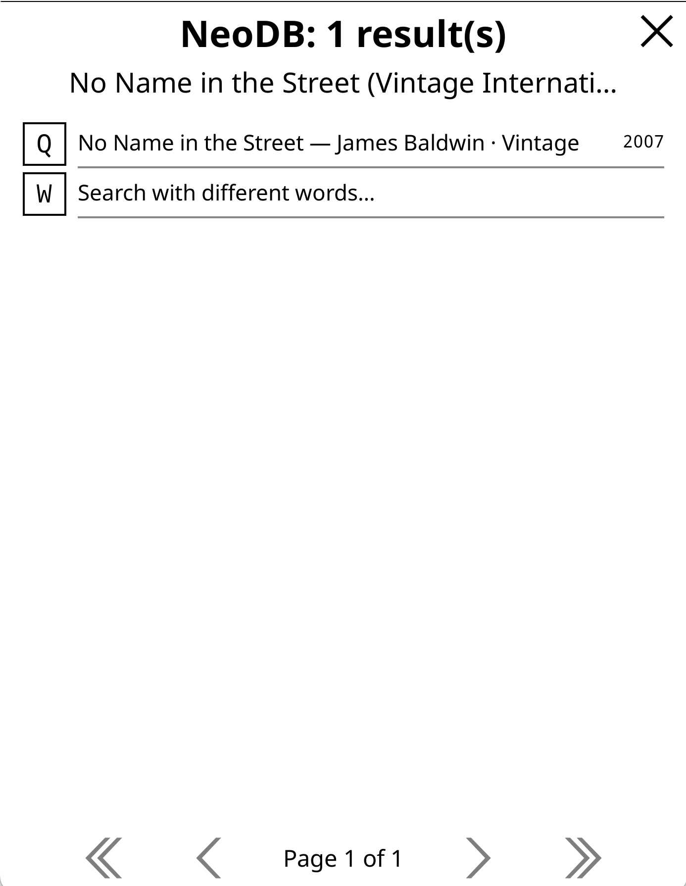
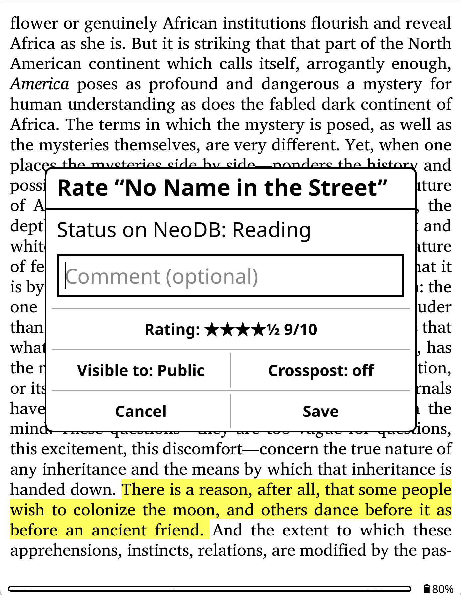
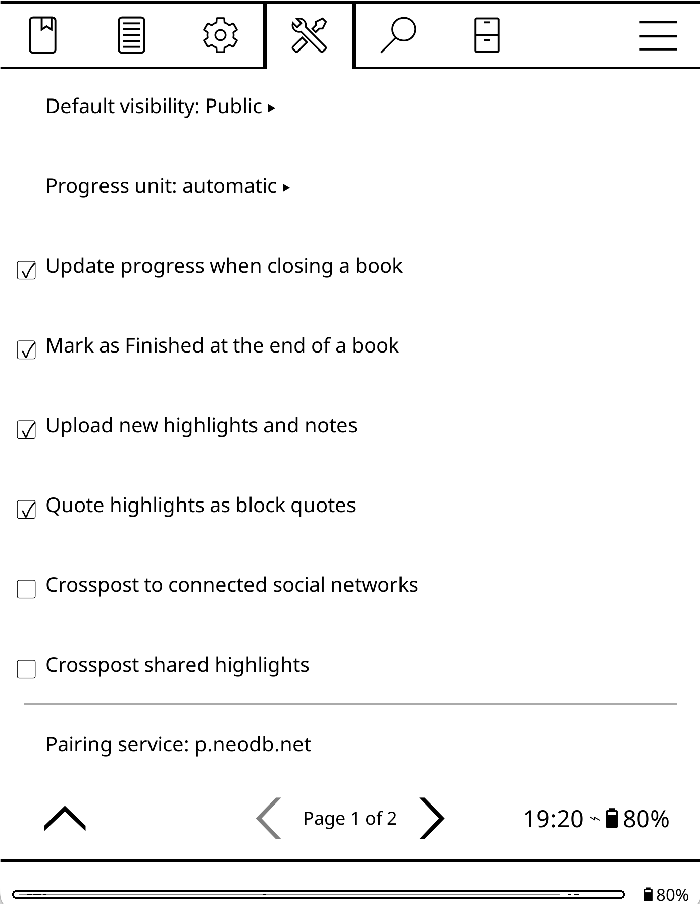

# NeoDB for KOReader

This plugin links the book you are reading in KOReader to a book edition on a NeoDB
server, then sync progress / notes / highlights / ratings, all without leaving the book.

## What's NeoDB

[NeoDB](https://neodb.net) is a free, open-sourced, distributed community, somewhat similar to Goodreads and
StoryGraph, but many such self-hosted servers that interconnected via open protocols like 
ActivityPub and ATProto. You may use NeoDB to share your reading journey with friends on 
Mastodon and Bluesky, or use it purely for private reading log, as NeoDB's privacy settings 
support both.

## Screenshots

| Link to a book | Rate and comment | Sync progress/highlights/etc |
|:---:|:---:|:---:|
|  |  |  |

## Install

Download [the latest release](https://github.com/neodb-social/neodb.koplugin/archive/main.zip),
unzip, rename the folder to `neodb.koplugin` and copy it into KOReader's `plugins` directory:

| Device | Path |
| --- | --- |
| Kobo | `.adds/koreader/plugins/` |
| Kindle | `koreader/plugins/` |
| Android | `koreader/plugins/` under internal storage |
| Desktop | `koreader/plugins/` next to the binary |

Restart KOReader. The plugin appears under **☰ → Tools → NeoDB**

For one-gesture access, bind **NeoDB: book actions** in
*Settings → Taps and gestures → Gesture manager*

## Signing in

Signing in is required, but just once. 
Open any book, then **☰ → Tools → NeoDB → Sign in to NeoDB…**.

### Scan a QR code (easiest)

The plugin shows a short link as a QR code; scan and sign in on your phone,
then tap **Done** on the reader.

This goes through a small pairing service on `p.neodb.net` ([source](https://github.com/neodb-social/portal)),
which is to help sign-in process and will not store any credentials after a few minutes.

If you would rather not involve a third party, point **Settings → Pairing
service** at your own deployment, or clear it to remove the option entirely.

### Enter a server address myself

The normal OAuth process, with no third party. Pick your instance, then choose one of:

**Authorize in a browser** — the plugin registers itself with the instance and
shows the authorization URL, as a QR code where available. You approve on
another device and type the code back.

**Type an access token** — if you would rather create one at
`https://your-instance/developer/`.

**Read a token from a file** — no typing. Save the token as the first line of a
text file named `neodb_token.txt`, copy it to your KOReader directory (or its
`settings/` subfolder) over USB, then pick this option.

## Linking a book

**NeoDB → This book → Find this book on NeoDB…** does the work:

1. If a valid ISBN can be found in the file's name or metadata, it searches for
   that. When the server confirms an entry with the same ISBN, the book is
   linked immediately.
2. Otherwise it searches by title and author and shows the matches, labelled
   with publisher and year so you can tell editions apart.
3. **Link by URL…** accepts a NeoDB book link, or a link from any site NeoDB can
   import from e.g. Goodreads, Google Books, Open Library, and Douban

The link is stored in the book's own sidecar metadata, so it survives a plugin
reinstall and travels with the file. It records which instance it came from, so
a link made on one server will not be used to post to another.

## Day to day

Everything is reachable from the book-actions sheet above, or from the menu:

- **The top row** names where the book stands, and opens the shelf list that
  changes it: Want to read / Reading / Finished / Dropped. Long-press it for the
  book-actions sheet.
- **Update progress** — updates reading progress manually. See below.
- **Rate and comment** — rating from ½ to 5 starts, plus an optional comment.
- **Add note** — make a note, optionally stamped with your position.
- **Settings for this book** — what NeoDB knows about this edition, with a 
  **Show QR code** button to open the book's page on your phone.
- **Post something…** — a post about nothing in particular. See below.

To share a quote manually, select the text and choose **Share on NeoDB** from the
selection menu. The highlight is prefilled as a block quote with the cursor
after it, ready for your own thought, and your reading position is attached.

## Posting something

**NeoDB → Post something…** writes a plain post on your NeoDB account, with no
book attached to it. It is the one entry that needs neither a link nor an open
book, so it is there in the file browser too, and it can be bound to a gesture as
**NeoDB: post something**.

Who sees it is a button on the composer, and it opens on your **Default
visibility** setting:

| Visible to | Means |
|---|---|
| Public | Anyone, and listed in public timelines. |
| Unlisted | Anyone with the link, but kept out of public timelines. |
| Followers only | The people who follow you. |
| Private | Only you. |

Written offline, the post is queued and goes out with everything else.

## Sharing every highlight

Rather than picking quotes one at a time, a book can post them all as you make
highlights: **NeoDB → Settings for this book → [ ] Upload new highlights and notes**. 
Check this, each highlight or note you make in this book will be sent to NeoDB as notes.

- Previously notes and highlights are left alone. Only highlights made after you flip
  the switch go out, so turning it on never flood a backlog into your timeline.
  **NeoDB → Upload all highlights and notes…** will upload the backlog.
- Upload is in background. An action is queued 10 seconds after you last make or update
  your annotations.
- Highlights done in offline will be queued and go out later.
- Deleting works in step, in books with this switch on: delete a highlight the
  plugin has posted and the matching NeoDB note is deleted too. One deleted before
  its post ever went out is simply never posted. Notes posted deliberately — the
  share composer, or an export from a book whose switch is off — stay on NeoDB.

Setting **Upload new highlights and notes** globally decides the setting for a
book when it's initially linked; every book keeps its own switch afterwards.
**Crosspost shared highlights** decides whether these notes reach your followers on
you connected Mastodon/Bluesky account.

## Using KOReader's own "Export highlights"

NeoDB also registers itself as a target in KOReader's built-in exporter, so it
appears in **☰ → Tools → Export highlights → Choose formats and services**
alongside Markdown, JSON and Readwise. Tick it once — it asks first — and every
one of the exporter's own entry points can post to NeoDB:

- **Export all notes in current book**
- **Export all notes in all books in history**
- **Export highlights** on a multi-selection in the file browser
- the matching gesture and profile actions

This is the only path that reaches many books at once, and the only one that works
from the file browser. It also honours the exporter's own **Filter by highlight
style** and **Filter by highlight colour**, so you can post only the highlights in
one colour.

Worth knowing:

- **Only books linked to a NeoDB entry are posted from.** Unlinked books are
  skipped, and the count is reported. Nothing goes looking for matches on its own.
- **A highlight is still posted only once.** KOReader's exporter re-sends
  everything every time it runs, but this plugin keeps its own record per book, so
  exporting the same book twice adds nothing the second time.
- Exporting posts from a linked book **whether or not that book's own "Upload new
  highlights and notes" switch is on**. That switch governs the silent automatic
  mirror; choosing to export is a deliberate act.
- KOReader exports to every enabled target at once, so with NeoDB ticked, an
  export to Markdown will also post to NeoDB — and will want a network connection.
  Untick NeoDB when you only want a file.
- The upload queue holds 100 items. A backlog larger than that is queued 100 at a
  time: the rest is left untouched and the notification tells you to export again
  once those have gone up, which continues exactly where it stopped.
- Needs KOReader **v2025.04** or newer, which is where the exporter gained a way
  for plugins to add targets. On older builds nothing appears, and the plugin's own
  **Upload all highlights and notes…** does the same job for one book.

## How progress is reported

NeoDB accepts a page number or a percentage. Which one is right depends on the
file, so the default (**Progress unit: Automatic**) decides per book:

| File | Reported as | Why |
| --- | --- | --- |
| PDF, DjVu, CBZ | page number | The page numbers are the book's own. |
| EPUB with a publisher page map | that page label | Real printed page numbers. |
| Other EPUB, FB2, MOBI… | percentage | Reflowed page numbers depend on your device, font and margins, so they would mean nothing to anyone else. |

You can override this per update with the **Unit** button in the progress
dialog, or globally in Settings.

A book you have not marked yet is put on **Reading** when you send progress, which
is what sending it implies. A book already marked, including *Finished* or
*Dropped*, is left exactly where you put it.

## Working offline

- Marks, progress updates and notes made offline are **queued**, and
  the status you set is shown straight away.
- The queue is uploaded the next time you are online — automatically when you
  open a book, or on demand via **NeoDB → Uploads**. The menu lists exactly what
  is waiting.
- Repeated progress updates for the same book collapse to the newest one; notes
  are each kept separately.
- An update that can never succeed (deleted item, revoked token) is discarded
  rather than blocking the queue.
- The automatic syncs never switch Wi-Fi on by themselves.

## Settings

| Setting | Default | Notes |
| --- | --- | --- |
| Default visibility | Public | Public / Followers only / Private. |
| Progress unit | Automatic | See the table above. |
| Crosspost to connected social networks | off | Marks and notes always reach NeoDB; this also crossposts them to your connected Mastodon and/or Bluesky account. |
| Quote highlights as block quotes | on | Prefixes shared highlights with `> `. |
| Pairing service | `p.neodb.net` | Used by QR sign-in. Clear it to hide that option. |
| Automatically update progress | off | Every hour while reading and when the book is closed, whenever the position moved. Only for books already marked. Queued silently — reading never waits on the network. |
| Mark as Finished at the end of a book | off | Fires when you reach the last page of a linked book. |
| Upload new highlights and notes | off | What a book starts with when it is linked; each book keeps its own switch under **This book**. See above. |
| Crosspost shared highlights | off | Whether shared highlights also reach your followers. Separate from the crosspost row above. |

## Technical notes and limitations

- **Your token is stored in plain text** on device. Anyone with access to the
  device or a backup of it can read them. 
  Revoke from your NeoDB instance if a device is lost.
- Your device's model name may be sent to your NeoDB instance, so it may show up
  in your timeline (e.g. "sent from Kobo") with some app. No other device 
  identifier were shared with your NeoDB instance. 
- Requests block KOReader's UI thread and times out after 25 seconds.
- Posting a mark replaces it on the server, so every write resends the rating,
  comment and tags you already had. If you edit a mark on the web while the book
  is open, use **Refresh from NeoDB** before changing it here.
- When NeoDB merges two entries, the link follows the surviving one by itself.
- A shared highlight is posted **once**, as it stands ten seconds after you last
  touch it. Editing it afterwards, or adding a note to one that has already gone
  out, changes nothing on NeoDB — KOReader does not even announce an edit to a
  note's text. Deleting it does: in a book whose "Upload new highlights and notes"
  switch is on, the NeoDB note goes too (or, if it was still waiting to upload, is
  quietly withdrawn). The id NeoDB gives each note is recorded against the
  highlight that produced it — that is what deletion uses, and what a later
  version would need to push an edit through. It reaches the book's sidecar
  whether that book is open, closed, or has been renamed since the highlight was
  queued — in the last case when you next open it. A note posted by a version of
  this plugin from before ids were recorded cannot be deleted from here.
- Renaming or deleting a book does not disturb anything waiting to upload: queued
  notes are addressed to the NeoDB entry, not to the file. A book deleted along
  with its sidecar loses its link, and nothing is written back to it.

## Source code layout

| File | Contents |
| --- | --- |
| `main.lua` | Plugin lifecycle, menus, gestures, highlight hook, auto-sync events |
| `neodb_api.lua` | HTTP client, endpoint wrappers, upload queue transport |
| `neodb_store.lua` | Account, preferences, per-book link, queue persistence |
| `neodb_login.lua` | Instance picker and the three sign-in flows |
| `neodb_match.lua` | Book identification, search UI, link management |
| `neodb_actions.lua` | Status, rating, progress, notes, quotes |
| `neodb_annotations.lua` | Mirroring KOReader's own highlights and notes to NeoDB |
| `neodb_exporter.lua` | NeoDB as a target in KOReader's "Export highlights" |
| `neodb_util.lua` | ISBN checksums, star rendering, JSON-null scrubbing, helpers |

Two things worth knowing before editing:

- KOReader bundles **luajson**, which has two traps, both of which bit this
  plugin on real hardware:
  - It decodes JSON `null` to a sentinel *function*, not `nil`, so every
    response goes through `Util.scrubNulls`. Without it,
    `if mark.comment_text then` is true for a null comment.
  - It infers array-ness from a table's contents and reports an **empty** table
    as *not* an array, so `{}` is encoded as the JSON object `{}`. Any list field
    must go through `Util.jsonArray` (or be omitted). This is what made NeoDB
    reject every mark with HTTP 422.
- Sibling modules are `neodb_`-prefixed because KOReader puts every plugin
  directory on one shared `package.path`, where a generic `api.lua` would
  collide with another plugin's.

